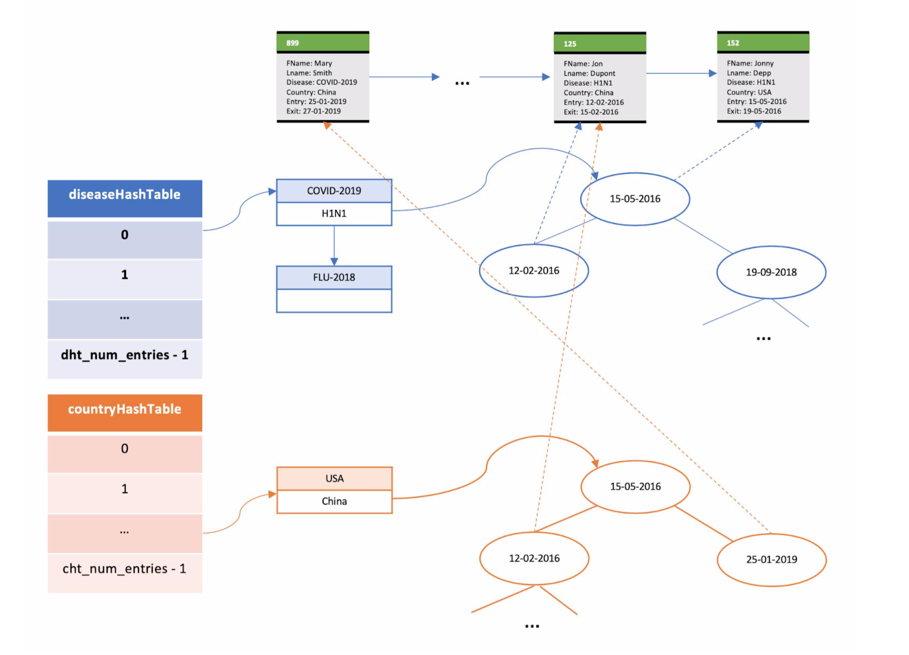

# Disease Monitoring Application

This application accepts, processes, records and answers questions about virus cases. Specifically, it is implemented a set of structures (hash
tables, linked lists, binary trees) that allow the entry and queries in a large volume of records of ```patientRecord``` type. Although the data will come from files, eventually all
records will be stored in main memory only.

## Application Interface

The application will be called ```diseaseMonitor``` and will be used as follows: 

```./diseaseMonitor -p patientRecordsFile –h1 diseaseHashtableNumOfEntries –h2 countryHashtableNumOfEntries –b bucketSize```

where: 

- The ```diseaseHashtableNumOfEntries``` parameter is the number of entries in a hashtable that the application will hold to detect patient information.
- The ```countryHashtableNumOfEntries``` parameter is the number of entries in a hashtable that the application will hold to detect positive cases per country. 
- The ```bucketSize``` parameter is the number of bytes that defines the size of each bucket of the hash tables.
- The ```PatientRecordsFile``` (or some other filename) is a file that contains a number of patient records for processing. Each line of this file describes a case of a
the patient's name, in which country, the date of admission to the hospital and the date he was discharged. For example if the contents of the file are:


  ```889 Mary Smith COVID-2019 China 25-1-2019 27-1-2019```

  ```776 Larry Jones SARS-1 Italy 10-02-2003 –```

  ```125 Jon Dupont H1N1 USA 12-02-2016 15-02-2016```

means that we have three records describing three cases in three different countries
(China, Italy, USA). In the second registration, there is no discharge date (the patient remains at
hospital). Specifically, a record is an ASCII line of text that consists of the following data:

1. ```recordID```: a string (it can have only one digit) that in a unique way
determines each such record.
2. ```patientFirstName```: a string consisting of letters without spaces.
3. ```patientLastName```: a string consisting of letters without spaces.
4. ```diseaseID```: a string consisting of letters, numbers, and possibly one hyphen “-” but without spaces.
5. ```country```: a string consisting of letters without spaces.
6. ```entryDate```: date of admission to the hospital. It must have the form DD-MM-YYYY where DD expresses the day, MM the month, and YYYY the year that 
the patient admitted to the hospital.
7. ```exitDate```: date the patient was discharged from the hospital. It must have the form DD-MM-YYYY where DD expresses the day, MM the month, and YYYY the year that the patient discharged from the hospital or hyphen (-) which means that the patient has not yet been discharged.

## Application Functionality

In the beginning, the application opens the ```patientRecordFile```, reads the lines one by one, initializes and stores in memory the data structures that will be used when executing the queries. Also, it checks the validity of the data in the file. For example, it can handle errors such as two records in the ```patientRecordFile``` with the same ```recordID```. Moreover, if it finds a record where the ```entryDate``` is later than ```exitDate```, then the application will display a message that the record is rejected. In particular, the applications handles the below errors:

When the application finishes processing the ```patientRecordsFile``` file, it will wait user input from the keyboard. The user will be able to give the following commands (arguments in [] are optional):

- ```/globalDiseaseStats [date1 date2]```:

    The application will print for each virus, the number of cases recorded in the system. If
  ```date1``` ```date2``` are provided, then the application will print for each virus the number of cases they have been
  recorded in the system within the time period ```[date1 ... date2]```.
  If there is a definition for ```[date1]```, then there should be a definition for ```[date2]``` as well, otherwise 
  an error message is printed to the user.

- ```/diseaseFrequency diseaseID [country] date1 date2```:

  If no ```country``` argument is given, then the application will print, for the disease ```diseaseID```, the number of cases they have been recored in the system     within the time period ```[date1 ... date2]```.   If ```country``` argument is given, then the application will print, for the disease ```diseaseID``` and the country ```country```, the number of cases they have been recored in the system within the time period ```[date1 ... date2]```.

- ```/topk-Diseases k country [date1 date2]```:
  
  The application will print, for the country ```country```, the diseases that are the top k of the cases
  within the period ```[date1 ... date2]``` if given. If there is a definition for ```[date1]```, then there should be a definition for ```[date2]``` as well,    otherwise an error message is printed to the user.

- ```/topk-Countries k diseaseID [date1 date2]```:
  
  The application will print, for the disease ```diseaseID```, the countries that have shown the top k of the cases of that disease.
  
- ```/insertPatientRecord recordID patientFirstName patientLastName diseaseID country entryDate [exitDate]```:

  The application will introduce a new registration with its data in the system. 
  
- ```/recordPatientExit recordID exitDate```:

  The application will add ```exitDate``` to the record with ID ```recordID```.
  
- ```/numCurrentPatients [diseaseID]```:

  If the argument ```diseaseID``` is given, the application will print the number of patients still being treated with
the disease ```diseaseID```. If no argument is given, the application will print, for each virus, the records of the patients still being treated.

- ```/exit```:

  Application exits. All memory is freed. 
  
## System Design and Data Structures


  
Our goal it to minimize the data duplication and make sure that for each sub-problem we need to solve, the most efficient algorithm or data structure is used. 

The following data structures have been implemented: 

1. Two hash tables (```diseaseHashTable``` and ```countryHashTable```) which offer fast access to patient records data indexes by case and country by case. The hash tables use buckets to serve ```diseases```/```countries``` that present colission (i.e., the result of the hash function leads to the same element of the hash table). If more than one bucket is needed to store the data, they are created dynamically and ordered into a list.
2. In order to know which ```patientRecords``` records exist at a given time and to have easy access to one through its ```recordID```, a hash table is maintained which maps ```RecordID``` to the corresponding ```patientRecord```. In essence, the value of this hash table is a pointer to the corresponding ```patientRecord``` record.
3. For every ```diseaseID``` that is hashed into an element of ```diseaseHashTable```, there is a set of ```patientRecords``` for patients who have been hospitalized due to the ```diseaseID``` disease. This set is placed in a balanced binary search tree. Each node of the tree provides information for a ```patientRecord``` record. The tree is sorted by the date of admission of the patient to the hospital. The balanced binary tree was implemented as an AVL tree. The main reason this structure was chosen over the Red-Black Tree is that AVLs offer faster look-ups. Similarly, when we have an application that there are many insertions, Red-Black Trees have a better response time. In the present project, the AVL trees with key the ```entryDate```  of a ```patientRecord``` store a pointer to each node in the corresponding record.
4. For the ```topk-Diseases``` command, the application builds binary heap on-the-fly (i.e., max heap) where each node holds all the cases of a ```diseaseID``` and 
facilitates the finding of the diseases that are the top k cases in the country. Similarly, for the ```topk-Countries``` command, the application builds binary heap on-the-fly (i.e., max heap) where each node holds the set of cases of a ```Country``` for a specific ```diseaseID```. The max heap was implemented as a binary tree. 
5. To reduce search time in ```topk-Diseases``` and ```topk-Countries``` commands, two global lists are maintained with the unique ```DiseaseIDs``` and ```Countries```.
6. All data structures were implemented to be generic.

## Memory Allocation/Deallocation

- Any memory is allocated dynamically and freed when the program exits or as soon as it is no longer needed.
- When reading the input file using ```fgets()``` the parsed line is stored in a ```buffer``` of size ```1025```. Such buffers are also used in various other functions such as converting ```date string``` to ```date struct``` struct tm (or vice versa).
- The delete functions of the data structures are configured so that only the hash table of the records deletes all the memory reserved for the ```patientRecord``` records. The other data structures simply delete the memory reserved for themselves and not the value they store, thus avoiding issues such as double free and memory corruption.

## Compilation 
Type ```make```

